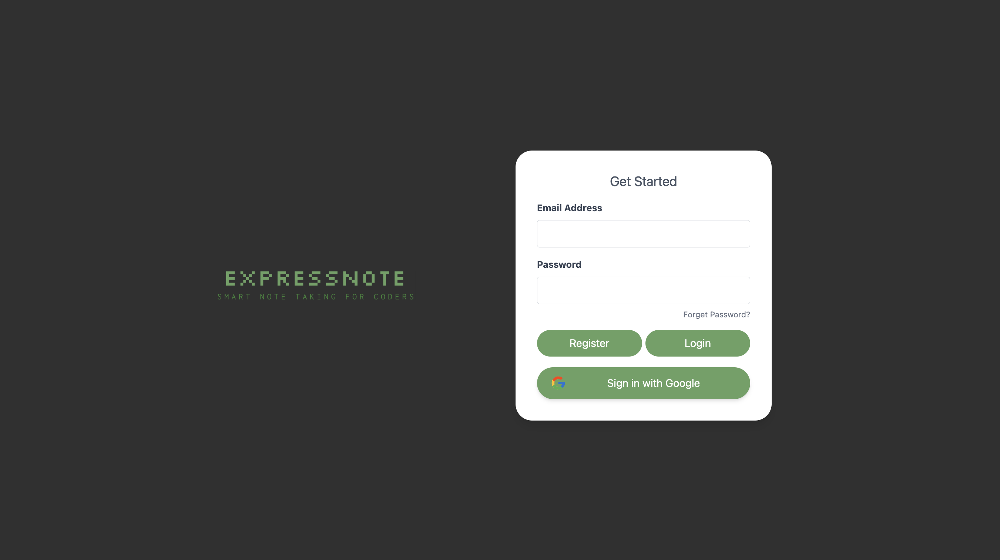

# Express Notes




A full-stack PERN app: fully customizable note-taking application with rich text, code, and images.

## Features

- Authentication (Local & Google OAuth)
- Rich Content Blocks
  - Text Editor
  - Code Editor
  - Image Viewer
- Grid-based Layout for Formatting

## Tech Stack

### Backend
- Node.js & Express
- PostgreSQL
- JWT Authentication
- Google OAuth 2.0
- Vitest for Testing

### Frontend
- React
- CodeMirror (Code Editor)
- Slate (Rich Text Editor)
- DaisyUI
- React Grid Layout
- html2pdf.js

## Setup Instructions

1. Clone the repository
2. Install dependencies:
   ```bash
   npm install
   ```

3. Create `.env` file with required variables:
   ```
   # Database
   DB_HOST=localhost
   DB_PORT=5432
   DB_NAME=express_notes
   DB_USER=your_username
   DB_PASSWORD=your_password

   # Authentication
   JWT_SECRET=your_jwt_secret
   SESSION_SECRET=your_session_secret
   GOOGLE_CLIENT_ID=your_google_client_id
   GOOGLE_CLIENT_SECRET=your_google_client_secret
   ```

4. Generate secrets:
   ```bash
   # JWT Secret
   node -e "console.log(require('crypto').randomBytes(64).toString('hex'))"

   # Session Secret
   node -e "console.log(require('crypto').randomBytes(32).toString('hex'))"
   ```

5. Start the server:
   ```bash
   npm start
   ```

## API Documentation

### Authentication Routes (`/api/auth`)

| Method | Endpoint | Description |
|--------|----------|-------------|
| GET | `/auth/google` | Initiates Google OAuth |
| GET | `/auth/google/callback` | Handles Google OAuth callback |
| POST | `/auth/register` | Local user registration |
| POST | `/auth/login` | Local user login |
| POST | `/auth/logout` | Handles user logout |
| GET | `/auth/profile` | Get user profile |

### Note Routes (`/api/notes`)

| Method | Endpoint | Description |
|--------|----------|-------------|
| POST | `/notes` | Create a new note |
| GET | `/notes` | Get all notes |
| GET | `/notes/:id` | Get a specific note |
| PUT | `/notes/:id` | Update a note |
| DELETE | `/notes/:id` | Delete a note |

### Page Routes (`/api/notes/:noteId/pages`)

| Method | Endpoint | Description |
|--------|----------|-------------|
| POST | `/notes/:noteId/pages` | Create a new page |
| GET | `/notes/:noteId/pages` | Get all pages for a note |
| GET | `/notes/:noteId/pages/:pageId` | Get a specific page |
| PUT | `/notes/:noteId/pages/:pageId` | Update a page |
| DELETE | `/notes/:noteId/pages/:pageId` | Delete a page |

### Block Routes (`/api/notes/:noteId/pages/:pageId/blocks`)

| Method | Endpoint | Description |
|--------|----------|-------------|
| POST | `/blocks` | Create a new block |
| GET | `/blocks/:pageId` | Get all blocks for a page |
| GET | `/blocks/:pageId/:blockId` | Get a specific block |
| PUT | `/blocks/:blockId` | Update a block |
| DELETE | `/blocks/:blockId` | Delete a block |

## Testing

The backend uses Vitest for testing with the following test suites:

- **Server Tests**: Integration tests for API endpoints
- **Auth Tests**: Authentication flow tests
- **Controller Tests**: Unit tests for note, page, and block controllers
- **Database Tests**: Database connection and query tests

Run tests with:
```bash
npm run test
```

## Development Tools

### Backend Testing
- Vitest: Test runner
- Axios Mock Adapter: Mock HTTP requests
- Node Mocks HTTP: Mock Express middleware
- pg-mem: Mock PostgreSQL database

### Frontend Development
- CodeMirror: Code editor component
- Slate: Rich text editor
- DaisyUI: UI components
- React Grid Layout: Grid system
- html2pdf.js: PDF export functionality

## Project Structure

```
server/
├── controllers/     # Route controllers
├── db/             # Database configuration
├── middleware/     # Express middleware
├── routes/         # API routes
├── __tests__/      # Test files
│   ├── unit/      # Unit tests
│   └── setup.js   # Test setup
└── server.js       # Entry point
```

## Contributing

1. Fork the repository
2. Create your feature branch
3. Commit your changes
4. Push to the branch
5. Create a Pull Request

## License

This project is licensed under the MIT License.